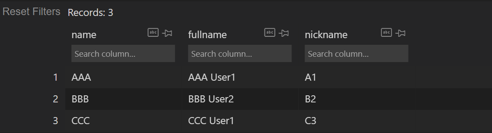

# Pandas与SA的ORM

### 构建一个Model

```python
from sqlalchemy import create_engine
from sqlalchemy.ext.declarative import declarative_base
from sqlalchemy import Column, Integer, String

# 构建engine和Base类
engine = create_engine('sqlite:///test2.db', echo=True)
Base = declarative_base()

# 构建User模型
class User(Base):
    __tablename__ = 'users'

    id = Column(Integer, primary_key=True)
    name = Column(String)
    fullname = Column(String)
    nickname = Column(String)

# 创建数据库及表
Base.metadata.create_all(engine)
```

### 创建Session

```python
from sqlalchemy.orm import sessionmaker

Session = sessionmaker(bind=engine)
session = Session()
```

### 加入dummy数据

```python
user1 = User(name='AAA', fullname='AAA User1', nickname='A1')
user2 = User(name='BBB', fullname='BBB User2', nickname='B2')
# 用add_all
session.add([user1, user2])
session.commit()
# 或者用add
session.add(user1)
session.add(user2)
session.commit()
```

### 查询的ORM写法（导入pandas的dataframe）


用statement转化为SQL原生语句


```python
import pandas as pd

# 查询User表中的全部
query_all = session.query(User).filter().statement   
df_all = pd.read_sql(query_all, engine)

# 查询前n个，如第一个
query_first = session.query(User).filter().limit(1).statement   
df_first = pd.read_sql(query_first, engine)

# filter中加条件，查询比如id>=3的
query = session.query(User).filter(User.id>=3).statement   
df = pd.read_sql(query, engine)

# 只要列出某几列，如fullname, nickname
query = session.query(User.fullname,User.nickname).filter(User.id>=3).statement   
df = pd.read_sql(query, engine)

```

### Pandas对于重复数据的处理

* 在SQL模型中设置的`unique=True`，对于`pandas.to_sql`是有作用的，会报错，导致所有数据写入失败
* 所以想到的方法是先进行一次读取，拼接上新的数据，进行一次`pd.drop_duplicates()`去重，再写入

#### 1、创建模型

```python
# User模型
class User(Base):
    __tablename__ = 'users'

    name = Column(String, primary_key=True)  # 这是主键，必须设定
    fullname = Column(String)
    nickname = Column(String)

# 创建表  
Base.metadata.create_all(engine)

# 创建session并添加数据
Session = sessionmaker(bind=engine)
session = Session()

user1 = User(name='AAA', fullname='AAA User1', nickname='A1')
user2 = User(name='BBB', fullname='BBB User2', nickname='B2')
session.add_all([user1, user2])
session.commit()
```

#### 2、定义去重后的写入方法

```python
## 假如有两组新的数据如下，并且构成了一个df1
c = {
    'name': 'AAA',
    'fullname': 'AAA User1',
    'nickname': 'A1'
}
d = {
    'name': 'CCC',
    'fullname': 'CCC User1',
    'nickname': 'C3'
}
df1 = pd.DataFrame([c, d])
```

```python
def update(df):
    """
    此处具体的参数，可以根据情况定义，比如模型，filter条件，engine等
    """
    
    query = session.query(User).filter().statement
    original_df = pd.read_sql(query, engine)
    # 纵线拼接，并且去除完全重复的行，对索引进行重置drop=True防止保留原index再新增一列
    df_new = pd.concat(
        [original_df, df]).drop_duplicates().reset_index(drop=True)

    # 写入users表，如果该表存在就replace替换，不要写入index
    df_new.to_sql('users', engine, if_exists='replace', index=False)

    # print(df_new)

update(df1)
```

对于drop\_duplicates用法，可见：[http://c.biancheng.net/pandas/drop-duplicate.html](http://c.biancheng.net/pandas/drop-duplicate.html)

<figure><figcaption><p>最终数据库中结果如图</p></figcaption></figure>
